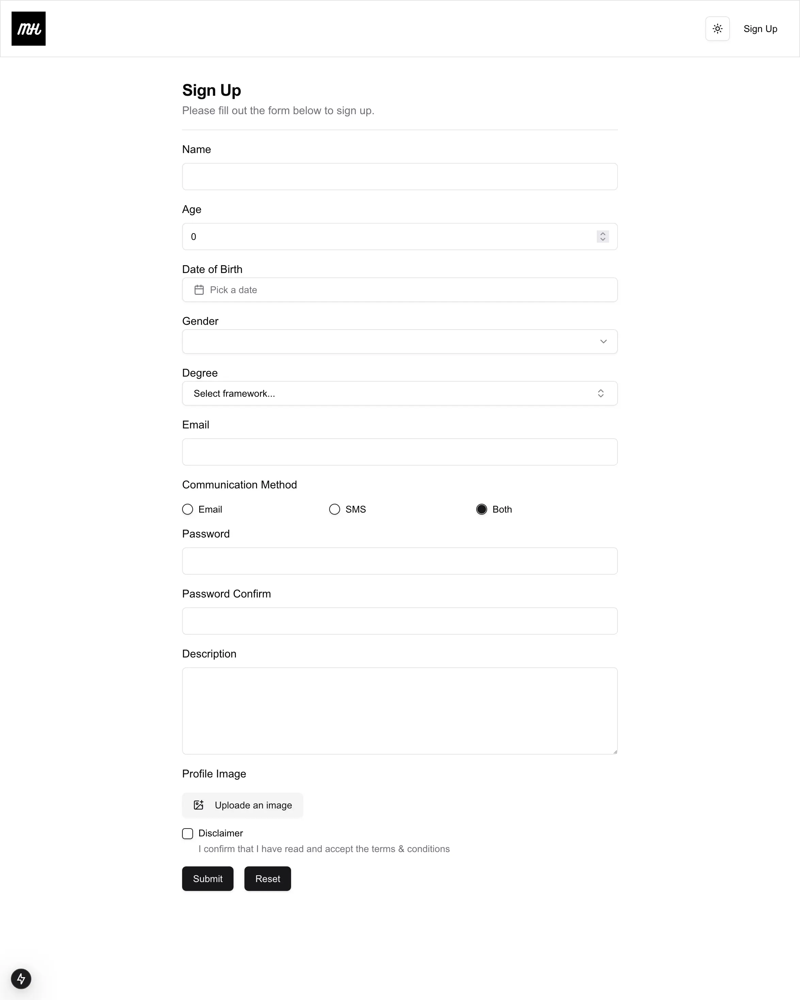

# React Form Components - Nextjs v15.1.3

This is [Next.js](https://nextjs.org/) project is bootstrapped with [`create-next-app`](https://github.com/vercel/next.js/tree/canary/packages/create-next-app). You can use this project as a refrence and create reusable form components using **Formik**, **Yup** and **Shadcn/ui**.

Explore the [demo](https://reusable-formik-components-mhaqnegahdar.vercel.app/) and [Note.md](./Note.md) for better understanding'.

It suppoerts all types of input fields like text, email, password, radio, checkbox, select, textarea, date, time, file, range, color, number, tel, url, combobox, image, and more.

For consistency through the project, the fields are also rendered dynamically from a single object.


## Technologies

- TSX, Tailwindcss,
- TypeScript
- **Nextjs v15**
- **Packages:** Formik, Yup
- **Routing:** using new app directory

## Features

- Dynamic Form Fields
- Reusable Form Input Components
- Suppoerts all input types
- Formik Container
- Fully Type Safe

## Installation

###### shell command

```shell
bun install

bun run dev
```
or

```shell
npm install

npm run dev
```

## Screenshots


